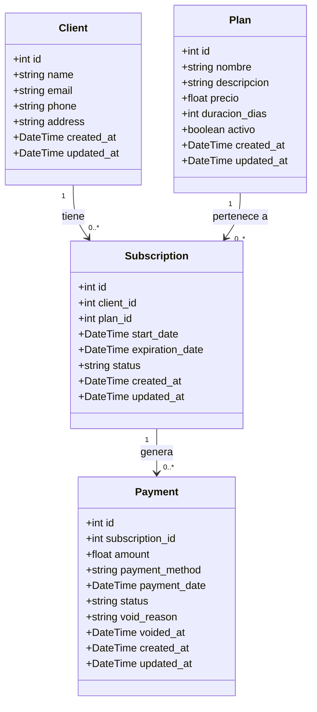

```mermaid
classDiagram
    class Client {
        +int id
        +string name
        +string email
        +string phone
        +string address
        +DateTime created_at
        +DateTime updated_at
    }
    class Plan {
        +int id
        +string nombre
        +string descripcion
        +float precio
        +int duracion_dias
        +boolean activo
        +DateTime created_at
        +DateTime updated_at
    }
    class Subscription {
        +int id
        +int client_id
        +int plan_id
        +DateTime start_date
        +DateTime expiration_date
        +string status
        +DateTime created_at
        +DateTime updated_at
    }
    class Payment {
        +int id
        +int subscription_id
        +float amount
        +string payment_method
        +DateTime payment_date
        +string status
        +string void_reason
        +DateTime voided_at
        +DateTime created_at
        +DateTime updated_at
    }
    Client "1" --> "0..*" Subscription : tiene
    Plan "1" --> "0..*" Subscription : pertenece a
    Subscription "1" --> "0..*" Payment : genera
```